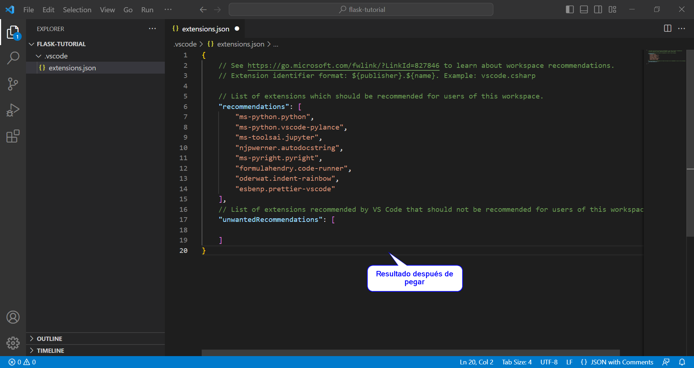

# Aprenda a crear su espacio de trabajo perfecto con Flask (Python): Guía completa para configurar un entorno de desarrollo

## Sobre Flask

[Flask](https://flask.palletsprojects.com/en/2.2.x/) es un marco de trabajo (_framework_) de [Python](https://www.python.org/) para el desarrollo de aplicaciones web. Es una herramienta flexible y fácil de usar, que permite crear rápidamente **aplicaciones web complejas** y escalables.

Una de las ventajas más destacadas de Flask es su tamaño pequeño y su facilidad de uso, lo que lo hace ideal para desarrolladores principiantes y experimentados. Además, Flask cuenta con una gran comunidad y una amplia gama de complementos y librerías disponibles, lo que lo hace una opción atractiva para el desarrollo de aplicaciones web. 

Algunas de las principales funciones de Flask incluyen la gestión de URLs, la integración con bases de datos y la creación de plantillas HTML. 

En resumen, Flask es un marco de trabajo de Python altamente recomendado para el desarrollo de aplicaciones web, especialmente por su facilidad de uso y su gran capacidad de personalización.

#  Instalación de Python

El primer paso para configurar un entorno de desarrollo adecuado para Flask es instalar Python. Este lenguaje de programación está disponible para una amplia gama de sistemas operativos, incluyendo MacOS, GNU/Linux y Windows. En este tutorial, se cubre la instalación en un **sistema operativo Windows**.

La versión mínima requerida para trabajar con Flask es Python 3.7 o superior, por lo que se recomienda descargar la última versión estable, disponible en la página oficial de Python: https://www.python.org/. Una vez descargado el instalador, ejecútelo y siga las instrucciones en pantalla para completar la instalación de Python en su sistema operativo.

1. Acceder a la página de descarga de Python en https://www.python.org/downloads/ y descargar el instalador.


2. Ejecutar el instalador descargado. Asegúrese de seleccionar la opción para agregar Python a su PATH durante la instalación.


3. Instalación finalizada


# Eligiendo un editor de código

El siguiente paso después de instalar Python es seleccionar un editor de código. Un editor de código es una herramienta que le permite escribir, editar y depurar programas.

[Visual Studio Code](https://code.visualstudio.com/) (VSCode) (o la alternativa libre [VSCodium](https://vscodium.com/)) es una excelente opción en este caso, por varias razones:

- Interfaz intuitiva.
- Integración de herramientas.
- Compatibilidad con Python.

Hay otras opciones perfectas, como [Neovim](https://neovim.io/) o [Sublime Text](http://www.sublimetext.com/), o IDEs completos como [PyCharm](https://www.jetbrains.com/pycharm/) o [Spyder](https://www.spyder-ide.org/), pero este tutorial continuará con VSCode.

## Instalación

1. Al igual que con Python, se deberá acceder a la pagina oficial https://code.visualstudio.com/Download para descargar el instalador, además ejecutarlo.


2. Aceptar términos y condiciones.


1. Seleccionar las opciones necesarias y continuar hasta finalizar la instalación.


2. Instalación finalizada, se debe reiniciar el equipo.


# Instalación de Flask y configuración del entorno

## Flask en un "entorno de proyecto"

Un entorno de proyecto en VSCode es un conjunto de configuraciones, extensiones y archivos de código que se utilizan para desarrollar una aplicación específica. Estos entornos pueden incluir la configuración del intérprete de Python, la configuración de la depuración y la configuración de otros plugins o extensiones relevantes para el proyecto.

En este caso, utilizar un entorno de proyecto en Visual Studio Code puede ser útil por varias razones:

- Aislamiento: Al tener un entorno de proyecto dedicado para un proyecto específico, se pueden aislar las dependencias y configuraciones de ese proyecto de las de otros. Esto es especialmente útil en caso de que diferentes proyectos requieran versiones diferentes de las mismas dependencias.
- Reproducibilidad: Al tener todas las dependencias y configuraciones registradas en el entorno de proyecto, es más fácil reproducir y compartir el entorno de desarrollo con otros desarrolladores.
- Consistencia: Al tener un entorno de proyecto dedicado, se puede asegurar una mayor consistencia en el desarrollo y pruebas del proyecto, ya que se pueden evitar problemas que surgen de diferencias en los entornos de desarrollo.
- Mejora de la productividad: Al tener un entorno de proyecto que incluya las extensiones y configuraciones adecuadas, se puede aumentar la productividad al tener acceso a herramientas y funcionalidades que son específicas para este.

En conclusión, seguir los siguientes pasos permitirá tener un entorno de desarrollo óptimo y organizado para trabajar con Flask.

## Configuración de VSCode

1. Crear y abrir una nueva carpeta para el proyecto, en este caso se llamará "flask-tutorial".


2. Instalar las extensiones necesarias, abriendo el archivo **extensions.txt** que se encuentra en la carpeta **extensions** de este repositorio, y copiando el contenido en el portapapeles.

3. Presionar **Ctrl+Shift+P** para abrir el menú de comandos y escribir **Configure Recommended Extensions**, borrar el contenido del archivo **extensions.json** y pegar el contenido del portapapeles.




4. Dirigirse al menú de extensiones, en la parte izquierda de VSCode. En la barra de búsqueda, escribir **@recommended** e instalar haciendo clic sobre el ícono de nube. Finalmente, reiniciar VSCode ignorando los mensajes de error.


5. Seleccionar un interprete de Python para el entorno de proyecto. Para ello, presionar **Ctrl+Shift+P** para abrir el menú de comandos y escribir **Python: Select Interpreter**. Seleccionar el entorno de Python que se instaló en los pasos anteriores.


6. Crear un nuevo entorno de proyecto en VSCode. Para ello, presionar **Ctrl+Shift+P** para abrir el menú de comandos y escribir **Python: Create environment**. Además, elegir la opción **Venv: Create a new virtual environment using venv**, y seleccionar el interprete anteriormente descrito. Esperar a que se cree el entorno de proyecto.


7. Correr una nueva terminal, con la combinación de teclas **Ctrl+Shift+`** o **Ctrl+Shift+ñ**. Donde probablemente se muestre el siguientre mensaje de error:

```
PS C:\Users\User\Documents\flask-tutorial> & "c:/Users/User/Documents/flask-tutorial/.venv/Scripts/Activate.ps1"
& : File C:\Users\User\Documents\flask-tutorial\.venv\Scripts\Activate.ps1 cannot be loaded because 
running scripts is disabled on this system. For more information, see about_Execution_Policies at 
https:/go.microsoft.com/fwlink/?LinkID=135170.
At line:1 char:3
+ & "c:/Users/User/Documents/flask-tutorial/.venv/Scripts/Activate. ...
+   ~~~~~~~~~~~~~~~~~~~~~~~~~~~~~~~~~~~~~~~~~~~~~~~~~~~~~~~~~~~~~~~~~~~
    + CategoryInfo          : SecurityError: (:) [], PSSecurityException
    + FullyQualifiedErrorId : UnauthorizedAccess
PS C:\Users\User\Documents\flask-tutorial>
```
8. Para solucionar este problema, se debe cambiar el `shell` de la terminal. Para ello, presionar **Ctrl+Shift+P** para abrir el menú de comandos y escribir **Terminal: Select Default Shell**. Seleccionar la opción **Command Prompt**.


9. Una vez cambiado el shell, se debe volver a correr la terminal, y se debe ver el siguiente mensaje, indicando que el entorno de proyecto se ha activado correctamente:

```
Microsoft Windows [Version 10.0.19045.2006]
(c) Microsoft Corporation. All rights reserved.

C:\Users\User\Documents\flask-tutorial>"c:/Users/User/Documents/flask-tutorial/.venv/Scripts/activate.bat"

(.venv) C:\Users\User\Documents\flask-tutorial>
```

## Instalación de Flask

1. Instalar Flask en el entorno de proyecto. Para ello, correr la terminal y escribir el siguiente comando:

```
(.venv) C:\Users\User\Documents\flask-tutorial>pip install flask
```

> **Nota**: `pip` es el gestor de paquetes de Python, y se utiliza para instalar y administrar paquetes de Python. En este caso, se utiliza para instalar Flask. Es una herramienta muy poderosa, y se puede encontrar variedad de paquetes en el repositorio de Python, [PyPI](https://pypi.org/).

# Probando Flask con un proyecto simple

En este punto, se sigue el tutorial oficial de Flask, [Flask Tutorial](https://flask.palletsprojects.com/en/2.0.x/tutorial/), para crear un proyecto de ejemplo. Además, la configuración del nuevos entornos para próximos proyectos, toma en cuenta únicamente los pasos 6 a 9 de la sección "Configuración de VSCode". Se usará una carpeta dedicada para este fin.

Se explicará el código de la aplicación, y se explicará el funcionamiento de cada archivo por medio de archivos Markdown y comentarios en el código.

# Referencias

- Automatically install extensions in VS Code? (2023, February 05). Retrieved from https://stackoverflow.com/questions/35929746/automatically-install-extensions-in-vs-code
- Dyouri, A. (2021). How To Create Your First Web Application Using Flask and Python 3. DigitalOcean. Retrieved from https://www.digitalocean.com/community/tutorials/how-to-create-your-first-web-application-using-flask-and-python-3
- Flask Documentation (2.0.x). (2022, March 28). Retrieved from https://flask.palletsprojects.com/en/2.0.x
- Managing Extensions in Visual Studio Code. (2023, February 05). Retrieved from https://code.visualstudio.com/docs/editor/extension-marketplace#_workspace-recommended-extensions
- Python and Flask Tutorial in Visual Studio Code. (2023, February 05). Retrieved from https://code.visualstudio.com/docs/python/tutorial-flask

<center><h2 style="text-align: center;">Licencia / License</h2>
<h3 style="text-align: center;">Isaac-PM @ <a href="https://github.com/Isaac-PM">https://github.com/Isaac-PM</a></h3>
<p style="text-align: center;">&nbsp;</p>
<p style="text-align: center;">Salvo que se indique lo contrario, esta obra tiene licencia <strong>Attribution-ShareAlike 4.0 International (CC BY-SA 4.0)</strong> @ <a href="https://creativecommons.org/licenses/by-sa/4.0/">https://creativecommons.org/licenses/by-sa/4.0/</a></p>
<p style="text-align: center;">Unless otherwise noted, this work is licensed <strong>Attribution-ShareAlike 4.0 International (CC BY-SA 4.0)</strong> @ <a href="https://creativecommons.org/licenses/by-sa/4.0/">https://creativecommons.org/licenses/by-sa/4.0/</a>.</p>
<p style="text-align: center;">&nbsp;</p>
<p style="text-align: center;"><strong>Derechos reservados a los autores indicados en el campo de referencias.</strong></p>
<p style="text-align: center;"><strong>All rights reserved to the authors indicated in the reference field.</strong></p></center>